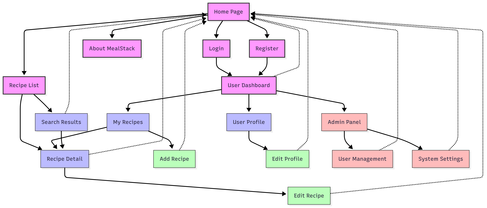

# 🍽️ MealStack – Your Recipe Book 📖

MealStack is an open-source, dynamic recipe website designed to help home cooks, food enthusiasts, and chefs organize, save, and discover their favorite recipes with ease. Whether you're experimenting with new cuisines or managing a personal recipe catalog, MealStack makes it simple and fun!

## 🚀 Features

### 📝 Core Features:
- **Add Recipes (Create):** Save new recipes by providing a title, ingredients, instructions, and optional tags (e.g., "Vegetarian", "Dessert").
- **View Recipes (Read):** Browse through all recipes or search by name or tag.
- **Edit Recipes (Update):** Modify existing recipes to refine ingredients or instructions.
- **Delete Recipes (Delete):** Remove recipes you no longer need.

### ✨ Enhanced Features (Optional but Fun):
- 🔍 **Search Functionality:** Find recipes instantly by title, tag, or ingredient.
- 🏷️ **Tagging System (or Categories):** Organize recipes with custom tags like "Quick Meals" or "Gluten-Free."
- ⭐ **Favorites:** Mark recipes as favorites for quick access.
- 📋 **Meal Planning:** Plan your meals for the week and generate shopping lists.

## 👥 Who is This For?
-  **Home Cooks:** Easily manage your personal cookbook.
-  **Food Enthusiasts:** Save and organize your latest recipe discoveries.
-  **Chefs & Professionals:** Maintain a structured recipe catalog for quick reference.

---

## 🛠️ Tech Stack & Implementation

###  Frontend:
- **Technologies:** HTML, CSS, JavaScript (with React integration)
- **Features:**
  - Responsive and user-friendly design.
  - Recipe list with options to **add, edit, delete, and view details**.
  - **Search functionality** for instant filtering.

###  Backend:
- **Framework:** ASP.NET Core MVC (C#)
- **API Endpoints (RESTful CRUD Operations):**
  - `POST /Recipes` → Add a new recipe.
  - `GET /Recipes` → Retrieve all recipes.
  - `GET /Recipes/{id}` → Get details of a specific recipe.
  - `PUT /Recipes/{id}` → Update an existing recipe.
  - `DELETE /Recipes/{id}` → Remove a recipe.

###  Database:
- **SQL Server (via Entity Framework Core 8.0.2)**
- **Schema Structure:**
  ```plaintext
  id          - Unique identifier for each recipe.
  title       - Name of the recipe.
  ingredients - List of ingredients.
  instructions - Step-by-step cooking guide.
  tags        - Optional tags (e.g., "Dessert", "Vegetarian").
  ```

## 🌎 Technical Aspects of MealStack
MealStack follows a client-server architecture implemented with ASP.NET Core MVC. The system follows the Model-View-Controller (MVC) pattern, which ensures scalability and maintainability.

- **Model:** Represents the recipe data, user profiles, and meal planning entities.
- **View:** Dynamically renders HTML pages or serves JSON responses for frontend frameworks.
- **Controller:** Handles user requests, processes input, and coordinates between views and models.

### Implementation Technologies and Platforms:
- **Programming Languages:**
  - C# (backend using ASP.NET Core MVC)
  - JavaScript (frontend with React integration)
- **Frameworks & Tools:**
  - ASP.NET Core MVC (web application framework)
  - Entity Framework Core 8.0.2 (ORM for database interactions)
  - .NET 8 (runtime and development platform)
- **Database:**
  - SQL Server (accessed via Entity Framework Core)
- **Authentication:**
  - ASP.NET Core Identity for user management and authentication

## 📊 Application Structure

### Initial Structure (v1)
Below is the initial application structure showing the user flow and main components:



### Final Structure (v2)
The refined application structure with expanded recipe categorization and improved user flows:


*Note: These diagrams represent the planned navigation and component structure. Implementation may vary during development.*

## 🔧 Proposed System Architecture
MealStack consists of the following core components:

1. **User Interface:**
- A responsive web interface using HTML, CSS, and JavaScript
- React integration for dynamic interactions
- Interacts with controllers through form submissions or AJAX requests

2. **ASP.NET Core MVC Application:**
- Controllers handle HTTP requests
- Models represent entities such as recipes and users
- Views render HTML pages or return JSON for API-driven interactions

3. **Database (via Entity Framework Core):**
- Stores recipe data, user accounts, tags, and meal plans
- Supports validation, constraints, and efficient querying

4. **Sample Routing for CRUD Operations:**
- `GET /Recipes` – Display all recipes
- `GET /Recipes/Create` – Show form to add a recipe
- `POST /Recipes/Create` – Add a new recipe
- `GET /Recipes/Edit/{id}` – Show edit form
- `POST /Recipes/Edit/{id}` – Update recipe
- `POST /Recipes/Delete/{id}` – Remove recipe

## 💻 Special Software or Hardware Requirements
MealStack does not require specialized software or hardware beyond a modern web browser or mobile device. It will follow a **mobile-first** design to ensure accessibility across different devices.

## 🎨 User Interface
A clean and responsive web-based interface will provide seamless access to MealStack's core features:
- Add, edit, delete, and view recipe details
- Favorite or share recipes
- Search/filter based on ingredients, tags, or categories

## 👨‍🍳 User Experience
A user-friendly interface is critical for MealStack's adoption. Key features include:
- **Quick Recipe Input:** Users can easily create and manage their recipe collection.
- **Search and Filtering:** Smart filtering options help users find recipes by ingredients, cuisine, and more.
- **Meal Planning Tools:** Optional features to plan meals for the week or generate shopping lists.

## 🔒 Additional Considerations
### Security:
- User data is secured via **HTTPS** and **secure authentication mechanisms** (ASP.NET Core Identity).
- Authorization policies ensure restricted access to sensitive data.

### Scalability:
- Designed for scalability using **stateless APIs**, making cloud deployment (e.g., Azure App Services) efficient.

### Accessibility:
- The UI will follow **WCAG accessibility standards** to ensure inclusivity for all users.

## 🛠️ Recent Updates
- Fixed EntityFrameworkCore version conflicts between EF Core 8.0.0 and 8.0.2
- Updated RecipeController to use RecipeEntity consistently throughout the application
- Fixed Identity layout path issues in Account/Manage area
- Updated project references and dependencies

## 🎉 Conclusion
MealStack has the potential to be a **powerful and user-friendly recipe management tool**. By leveraging **ASP.NET Core MVC, Entity Framework Core, and modern frontend technologies**, the application is well-structured, maintainable, and scalable.

With continuous improvements, MealStack helps users **organize, discover, and share meals** effortlessly, promoting healthier eating habits and reducing food waste.

---

## 📜 License

This project is licensed under the **MIT License** – see the [LICENSE](./LICENSE) file for details.
